# Secondary Entry Points Analysis

## Current Status

- Implemented: button, badge, accordion, tabs, input, select-button, core.
- Pending: card, checkbox, select, icon, layout, theme, tokens.

## Export Inventory (current public-api.ts)

Primary entry point exports from `projects/ui-lib-custom/src/public-api.ts`:

- `UiLibCustom` from `./lib/ui-lib-custom`
- `design-tokens` from `./lib/design-tokens`
- `button` from `./lib/button/button`
- `button-group` from `./lib/button-group/button-group`
- `card` from `./lib/card/card`
- `badge` from `./lib/badge/badge`
- `checkbox` from `./lib/checkbox/checkbox`
- `login-1` from `./lib/login/login-1/login-1.component`
- `login-2` from `./lib/login/login-2/login-2.component`
- `login-3` from `./lib/login/login-3/login-3.component`
- `login-contract` types from `./lib/login/models/login-contract`
- `layout` from `./lib/layout` (exports `design-tokens`, `stack`, `inline`, `grid`, `container`)
- `theming` from `./lib/theming/theme-config.service` and `./lib/theming/theme-preset.interface`
- `login-form` from `./lib/login-form/login-form`
- `input` from `./lib/input/input`
- `select` from `./lib/select/select`
- `select-button` from `./lib/select-button` (exports `select-button` + `select-button.types`)
- `sidebar-menu` from `./lib/sidebar-menu/sidebar-menu`
- `icon` from `./lib/icon` (index exports `icon`, `icon.service`, `icon.types`, `icon.tokens`, `presets`, `icon.semantics`, `icon.providers`)
  - Additional named exports in `public-api.ts`: `Icon`, `IconService`, `IconSize`, `IconLibrary`, `IconConfig`, `SemanticIcon`, `provideUiLibIcons`
- `icon-button` from `./lib/icon-button/icon-button`
- `alert` from `./lib/alert/alert`
- `tabs` from `./lib/tabs/tabs`
- `tab` from `./lib/tabs/tab` (named exports `TabLabel`, `TabContent`)
- `tab-panel` from `./lib/tabs/tab-panel`
- `tabs.types` from `./lib/tabs/tabs.types`
- `accordion` from `./lib/accordion/accordion`
- `accordion-panel` from `./lib/accordion/accordion-panel`
- `accordion.types` from `./lib/accordion/accordion.types`

Not exported (internal-only today):

- `accordion-context` (`AccordionContext` + `ACCORDION_CONTEXT`)
- `login/base-login` and login templates (internal base class)
- `theming/utils/file-download`
- `icon` preset JSON and CSS assets, `themes.scss` / `themes.css`

## Dependency Graph (internal library dependencies)

Mermaid graph of internal imports (components only). External Angular modules are omitted.

```mermaid
graph TD
  DesignTokens[design-tokens]
  Layout[layout index]
  Stack[layout/stack]
  Inline[layout/inline]
  Grid[layout/grid]
  Container[layout/container]

  Button[button]
  ButtonGroup[button-group]
  Card[card]
  Badge[badge]
  Checkbox[checkbox]
  Input[input]
  Select[select]
  SelectButton[select-button]
  SidebarMenu[sidebar-menu]
  Alert[alert]
  IconButton[icon-button]
  Tabs[tabs]
  Tab[tab]
  TabPanel[tab-panel]
  TabsTypes[tabs.types]
  Accordion[accordion]
  AccordionPanel[accordion-panel]
  AccordionTypes[accordion.types]
  AccordionContext[accordion-context]
  Login1[login-1]
  Login2[login-2]
  Login3[login-3]
  LoginForm[login-form]
  BaseLogin[login/base-login]
  LoginContract[login-contract]
  Icon[icon]
  IconService[icon.service]
  IconTypes[icon.types]
  IconSemantics[icon.semantics]
  IconTokens[icon.tokens]
  IconProviders[icon.providers]
  IconPresets[icon.presets]
  ThemingService[theme-config.service]
  ThemePreset[theme-preset.interface]
  ThemingUtils[theming/utils/file-download]

  Layout --> Stack
  Layout --> Inline
  Layout --> Grid
  Layout --> Container
  Layout --> DesignTokens
  Stack --> DesignTokens
  Inline --> DesignTokens
  Grid --> DesignTokens
  Container --> DesignTokens

  Button --> Icon
  Button --> IconTypes
  Button --> IconSemantics
  Button --> Badge
  ButtonGroup --> Button
  Card --> Icon
  Card --> IconSemantics
  Alert --> Icon
  Alert --> IconSemantics
  IconButton --> Icon
  IconButton --> IconTypes
  IconButton --> IconSemantics

  Tabs --> Icon
  Tabs --> Tab
  Tabs --> TabPanel
  Tabs --> TabsTypes
  Tab --> TabsTypes

  Accordion --> AccordionPanel
  Accordion --> AccordionContext
  Accordion --> AccordionTypes
  AccordionPanel --> AccordionContext
  AccordionPanel --> AccordionTypes
  AccordionPanel --> Icon
  AccordionContext --> AccordionTypes

  Login1 --> BaseLogin
  Login2 --> BaseLogin
  Login3 --> BaseLogin
  BaseLogin --> LoginContract
  Login1 --> Container
  Login1 --> Stack
  Login1 --> Inline
  Login1 --> Card
  Login1 --> Button
  Login1 --> Input
  Login2 --> Container
  Login2 --> Stack
  Login2 --> Inline
  Login2 --> Card
  Login2 --> Button
  Login2 --> Input
  Login3 --> Container
  Login3 --> Stack
  Login3 --> Grid
  Login3 --> Inline
  Login3 --> Card
  Login3 --> Button
  Login3 --> Input
  LoginForm --> Button
  LoginForm --> Card

  Icon --> IconService
  Icon --> IconTypes
  Icon --> IconSemantics
  IconService --> IconTokens
  IconService --> IconTypes
  IconService --> IconSemantics
  IconService --> IconPresets
  IconService --> ThemingService
  IconProviders --> IconTokens
  IconProviders --> IconTypes
  IconProviders --> IconPresets
  IconTypes --> ThemePreset
  ThemingService --> ThemePreset
  ThemingService --> DesignTokens
  ThemingService --> IconTypes
  ThemingService --> ThemingUtils
  ThemePreset --> IconTypes
```



Key internal dependency notes:

- `icon` depends on `theme-config.service` (optional injection), which creates a compile-time dependency from icon entry point to theming.
- `icon.types` imports `ThemeVariant` from theming, and `theme-preset.interface` imports `IconLibrary`/`IconSize` from icon. This is an existing type-level cycle.
- `layout` relies on `design-tokens` for spacing and size tokens.
- Login variants are composed from layout primitives + `card` + `button` + `input`.
- `select-button` wraps `button` for UI consistency.

## ng-packagr Secondary Entry Points (research summary)

Required file structure (ng-packagr):

- Each secondary entry point lives under a sibling folder to the primary `ng-package.json`.
- Each secondary entry point folder includes its own `ng-package.json` and `public-api.ts`.
- `public-api.ts` should only re-export symbols from `src/lib/...` (or local index files).
- ng-packagr will build each secondary entry point into its own bundle and include it in the `package.json` `exports` map (depending on ng-packagr version).

Example structure (proposed):

```
projects/
  ui-lib-custom/
    ng-package.json
    src/
      public-api.ts
      lib/
        button/
        icon/
        theming/
        ...
    button/
      ng-package.json
      public-api.ts
    icon/
      ng-package.json
      public-api.ts
    theming/
      ng-package.json
      public-api.ts
```

Angular 21+ considerations:

- Standalone components are compatible; no NgModule shimming required.
- Keep entry point public APIs explicit and minimal (avoid re-exporting unrelated subpaths).
- Ensure `package.json` `sideEffects` remains false for tree-shaking.
- Prefer explicit types in public APIs (already consistent with library conventions).
- Avoid re-exporting JSON preset files directly from TS entry points unless consumers need runtime access.

Circular dependency risks:

- The existing `icon.types` <-> `theme-preset.interface` type cycle can become more visible when split into separate entry points.
- `icon` entry point depends on `theming` (via `ThemeConfigService`), and `theming` depends on `icon` (via `ThemePreset` types). This can cause bundler warnings in some setups.
- If this becomes a packaging issue, consider moving shared types into a neutral entry point (e.g. `ui-lib-custom/shared-types`) or inverting imports to reduce the cycle.

## Bundle Impact Analysis

Common import groupings observed in the library:

- `button` + `icon` + `badge` (button depends on both).
- `card` + `icon` (card depends on icon).
- `alert` + `icon` (alert depends on icon).
- `select-button` + `button` (select-button depends on button).
- `tabs` + `icon` (tabs depends on icon).
- Login templates: `layout` + `card` + `button` + `input`.
- `icon` + `theming` are effectively coupled due to `ThemeConfigService` usage and shared types.

Shared code candidates for the primary entry point:

- `design-tokens` (used by layout and theming, likely needed broadly).
- `icon` + `theming` (if cycles are too risky, keep them in primary and only add a secondary `icon` after the cycle is resolved).
- `layout` primitives (commonly used with multiple components; consider a `layout` entry point).

## Proposed Entry Point Structure

Recommended secondary entry points (initial pass):

- `ui-lib-custom/button`
- `ui-lib-custom/button-group`
- `ui-lib-custom/badge`
- `ui-lib-custom/card`
- `ui-lib-custom/checkbox`
- `ui-lib-custom/input`
- `ui-lib-custom/select`
- `ui-lib-custom/select-button`
- `ui-lib-custom/sidebar-menu`
- `ui-lib-custom/alert`
- `ui-lib-custom/icon`
- `ui-lib-custom/icon-button`
- `ui-lib-custom/tabs` (exports tabs + tab + tab-panel + tabs.types)
- `ui-lib-custom/accordion` (exports accordion + accordion-panel + accordion.types)
- `ui-lib-custom/layout` (exports stack/inline/grid/container + design-tokens)
- `ui-lib-custom/design-tokens`
- `ui-lib-custom/theming` (theme-config.service + theme-preset.interface)
- `ui-lib-custom/login` (exports login-1/2/3 + login-contract)
- `ui-lib-custom/login-form`

Notes:

- Keep the existing primary barrel (`ui-lib-custom`) for backward compatibility.
- For coupled areas, consider flattening per-feature packages:
  - `ui-lib-custom/icon` should include `icon.service`, `icon.types`, `icon.providers`, `icon.semantics`, and `icon.presets`.
  - `ui-lib-custom/theming` should include `theme-config.service`, `theme-preset.interface`, and `theming/utils/file-download` (if you want it public), but avoid exposing it unless needed.

## Risk Assessment

- Circular type dependency (`icon.types` <-> `theme-preset.interface`) could create bundler warnings or runtime cycles when split into separate entry points.
- `icon` depends on `theming`, so importing `ui-lib-custom/icon` may still pull theming code into the bundle.
- Some components (login templates) are composite and will import multiple entry points; tree-shaking gains are limited for those features.
- Exporting `design-tokens` in both `layout` and a dedicated `design-tokens` entry point can cause redundant imports; ensure re-exports are intentional and consistent.
- If `themes.scss` and `themes.css` assets are needed by consumers, ensure they are still copied via `ng-package.json` assets when adding secondary entry points.
